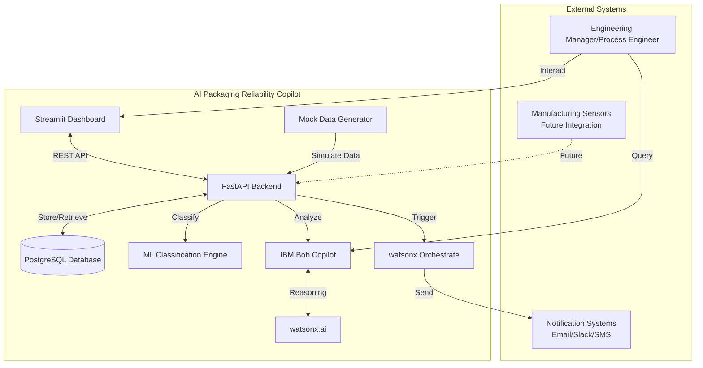
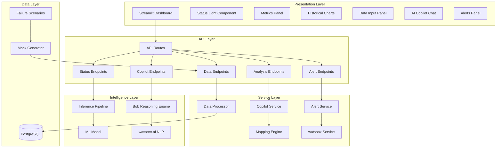
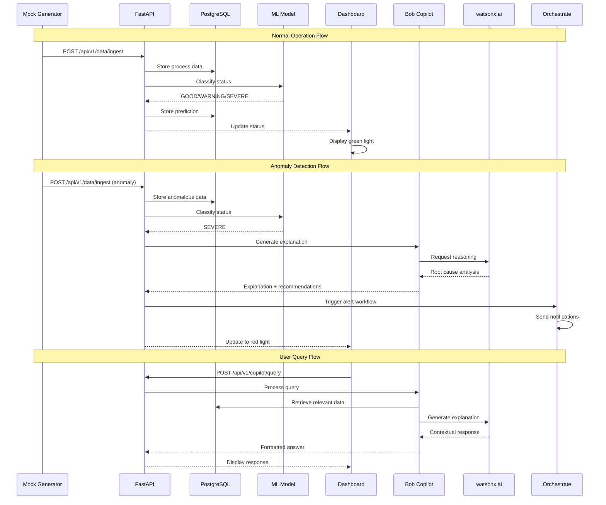
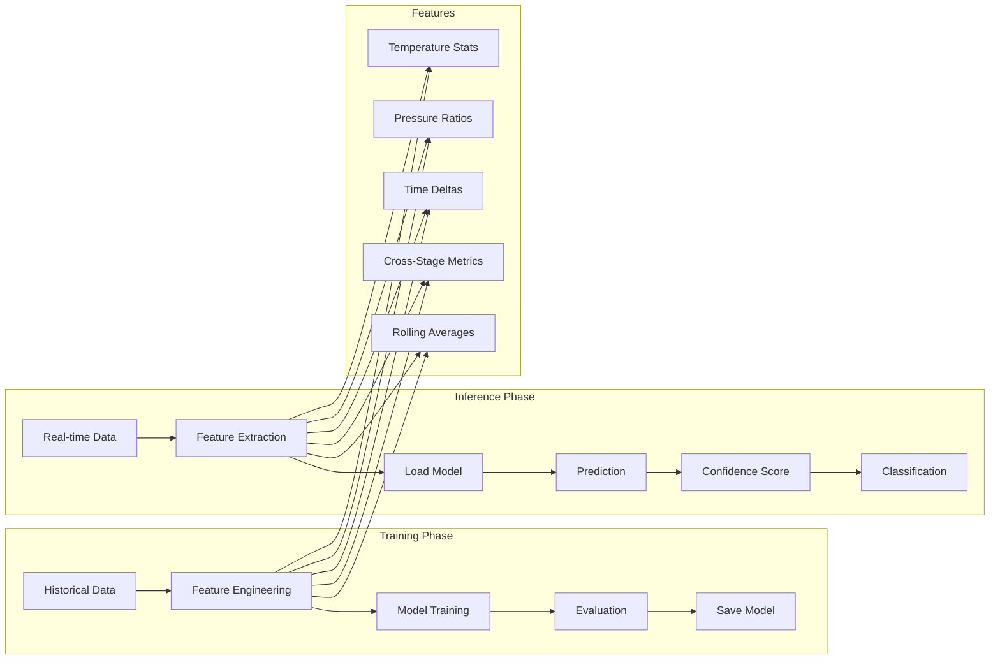
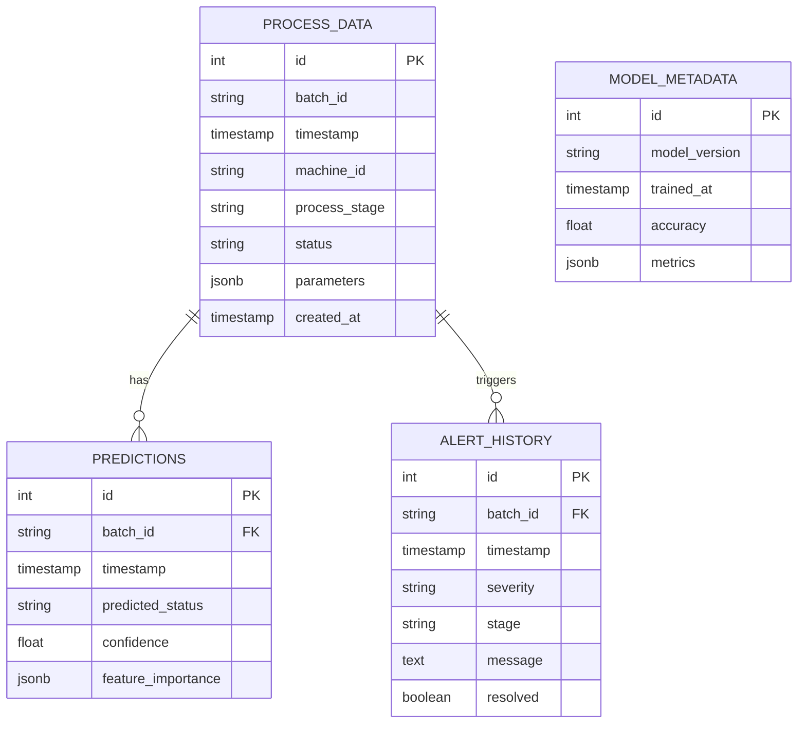
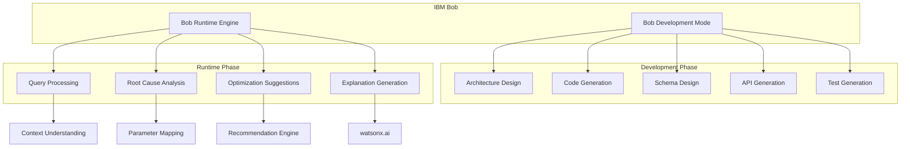
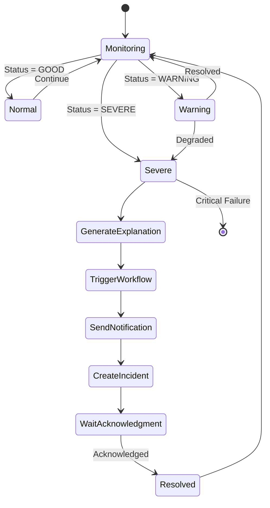
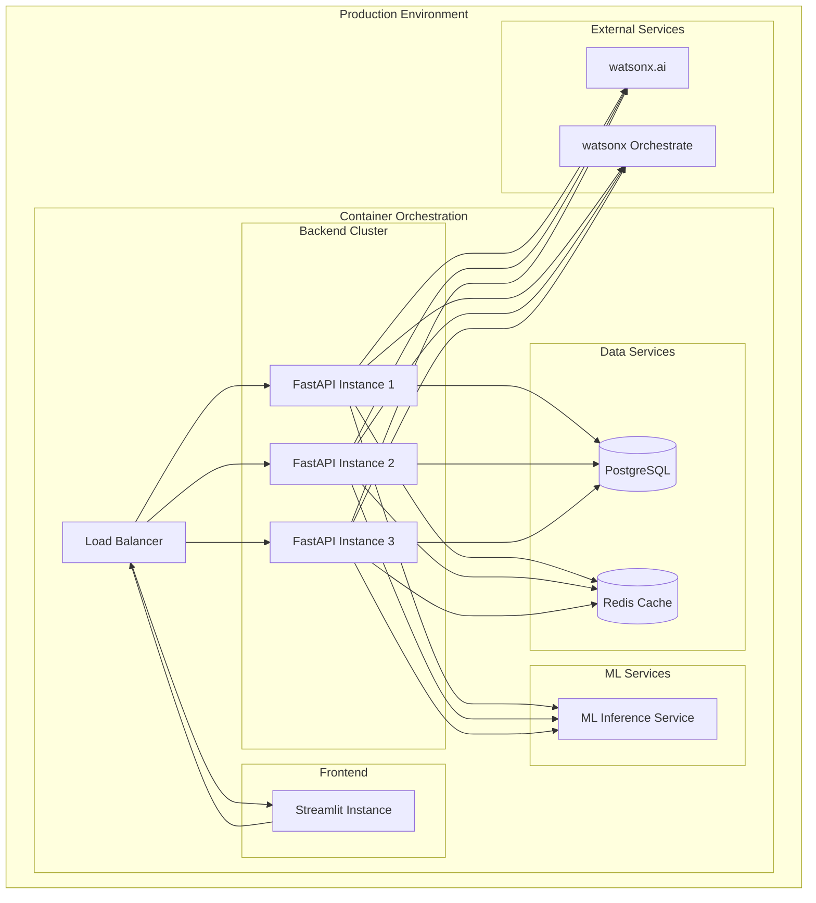
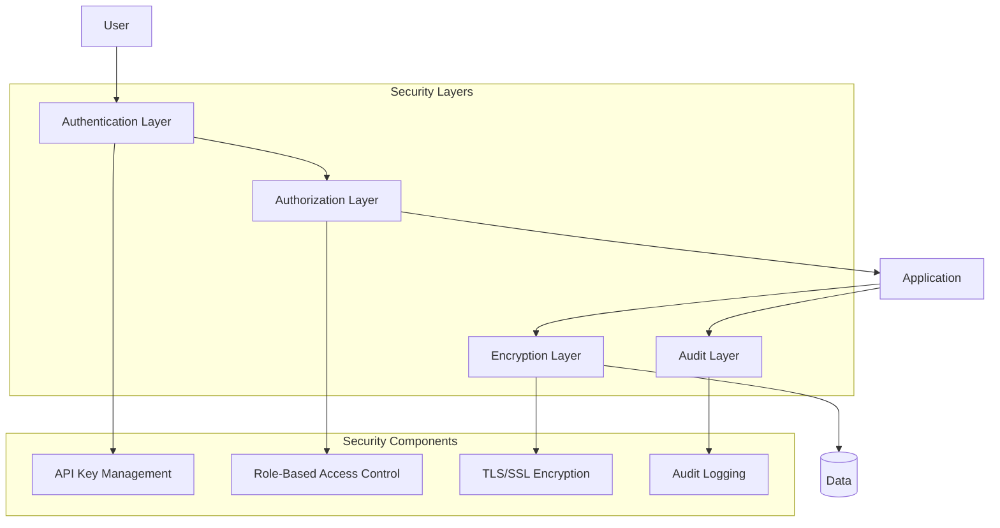
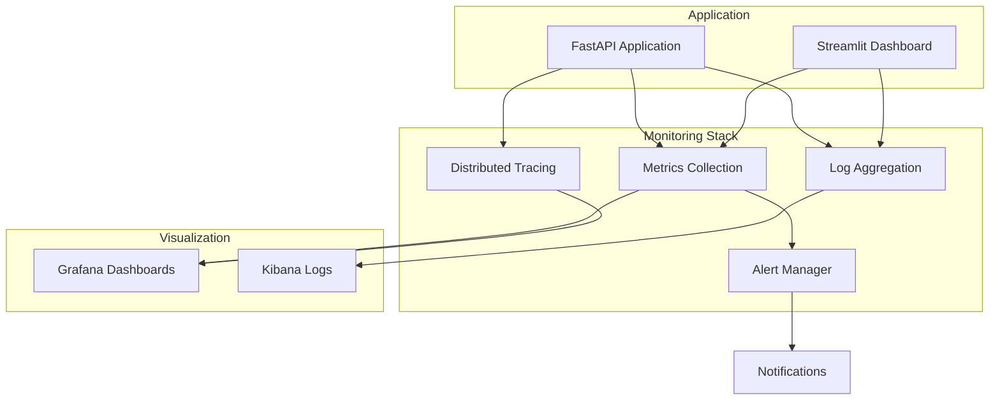

# AI Packaging Reliability Copilot - Architecture Diagrams

## 1. System Context Diagram

## 2. Component Architecture

## 3. Data Flow Architecture

## 4. ML Pipeline Architecture

## 5. Database Schema Diagram

## 6. IBM Bob Integration Points

## 7. Alert Workflow

## 8. Deployment Architecture

## 9. Security Architecture

## 10. Monitoring & Observability

---

## Diagram Explanations

### System Context Diagram
Shows the high-level interaction between users, external systems, and the AI Packaging Reliability Copilot platform.

### Component Architecture
Illustrates the internal structure of the system, showing how different layers and components interact.

### Data Flow Architecture
Demonstrates the sequence of operations for normal operation, anomaly detection, and user queries.

### ML Pipeline Architecture
Details the machine learning workflow from training to inference, including feature engineering.

### Database Schema Diagram
Shows the relational structure of the database, including tables and their relationships.

### IBM Bob Integration Points
Highlights where IBM Bob is used during development and runtime phases.

### Alert Workflow
State diagram showing the alert lifecycle from detection to resolution.

### Deployment Architecture
Production deployment setup with load balancing, clustering, and external service integration.

### Security Architecture
Security layers and components ensuring system protection.

### Monitoring & Observability
Monitoring infrastructure for system health and performance tracking.

---

## Key Architectural Decisions

### 1. Microservices vs Monolith
**Decision**: Modular monolith for hackathon, designed for microservices migration
**Rationale**: Faster development while maintaining clear boundaries

### 2. Database Choice
**Decision**: PostgreSQL
**Rationale**: JSONB support for flexible parameter storage, strong ACID compliance

### 3. Real-time Communication
**Decision**: HTTP polling initially, WebSocket for future
**Rationale**: Simpler implementation, adequate for demo

### 4. ML Model Deployment
**Decision**: In-process inference
**Rationale**: Lower latency, simpler deployment for POC

### 5. Frontend Framework
**Decision**: Streamlit
**Rationale**: Rapid development, Python-native, excellent for data visualization

---

**Status**: Architecture diagrams complete ✅
**Next**: Clarifying questions and data schema design